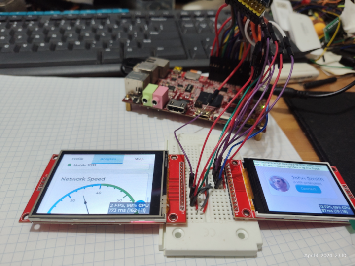
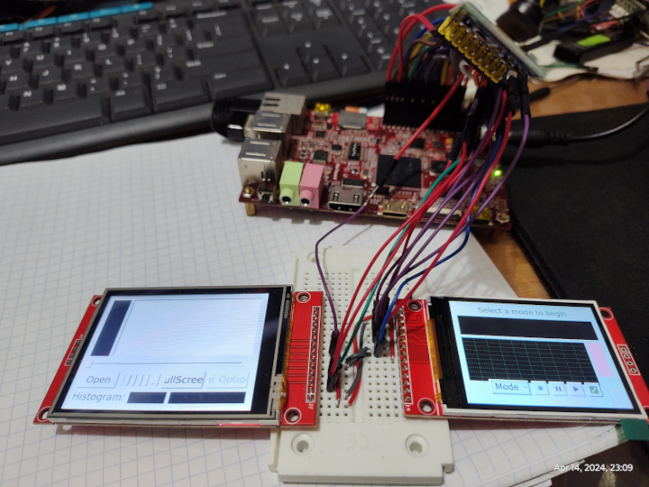
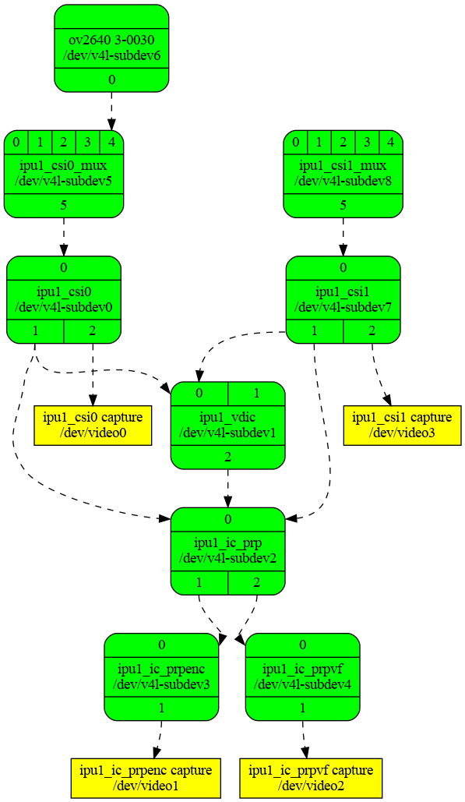
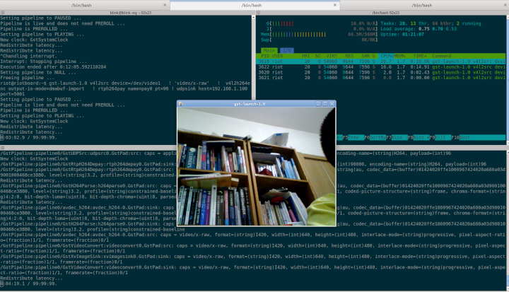
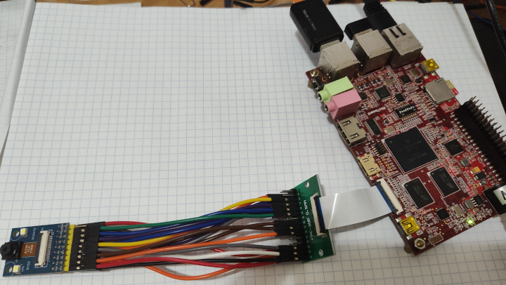

# RIotBoard
## Product Introduction
The RIoTboard is an evaluation platform featuring the powerful i.MX 6Solo, a
multimedia application processor with ARM Cortex-A9 core at 1 GHz from Freescale
Semiconductor. The platform helps evaluate the rich set of peripherals and includes
a 10/100/Gb Ethernet port, HDMI v1.4, LVDS, analog headphone/microphone, uSD
and SD card interface, USB, serial port, JTAG, 2 camera interfaces, GPIO boot
configuration interface, and expansion port.

Releases:
* [Kernel 6.9.1](#kernel-6.9.1)
* [u-boot - 2018.05 ](#u-boot)
* [Debian 12(bookworm)](https://www.debian.org/News/2023/20230610)

## U-boot

Uboot Build instructions.

* Install dependencies

```sh
    sudo apt-get install device-tree-compiler gcc-arm-linux-gnueabi
```

* Build and Install u-boot (SD/MMC card)

```sh
    cd u-boot-2018.05
    ARCH=arm CROSS_COMPILE=arm-linux-gnueabi- make riotboard_config
    ARCH=arm CROSS_COMPILE=arm-linux-gnueabi- make -j $(nproc)
    dd if=u-boot.imx of=/dev/sdb bs=1024 seek=1

```

* Pre-built

```sh
    https://github.com/yjdwbj/imx6-riotboard/archive/refs/tags/v1.0.tar.gz
```


## Kernel 6.9.1

Kernel 6.9.1 is rock solid in RIotBoard, building **Kernel 6.9.1** with gcc-12 on uSD for testing new devfreq and checking stability.
The board works great in real time using Gstreamer and a hardware h264 encoder.


Testing mainline **6.9.1**, current status:

* Eth0 - ok
* Wifi Realtek 8812AU/8821AU (5 GHz) - ok
* Wifi mt7601u (2.4 GHz) - ok
* eMMC - ok
* hdmi - ok (for debugging)
* sound - JACK output and HDMI output (ok)
* USB2 - ok
* fbdev - ok (for ili9341 spi)
* parallel camera - ok (for ov2640 sccb)

## Benchmarks

* CPU info

```sh
riot@bookwarm:~$ lscpu
Architecture:                       armv7l
Byte Order:                         Little Endian
CPU(s):                             1
On-line CPU(s) list:                0
Thread(s) per core:                 1
Core(s) per socket:                 1
Socket(s):                          1
Vendor ID:                          ARM
Model:                              10
Model name:                         Cortex-A9
Stepping:                           r2p10
CPU max MHz:                        996.0000
CPU min MHz:                        396.0000
BogoMIPS:                           6.00
Vulnerability Gather data sampling: Not affected
Vulnerability Itlb multihit:        Not affected
Vulnerability L1tf:                 Not affected
Vulnerability Mds:                  Not affected
Vulnerability Meltdown:             Not affected
Vulnerability Mmio stale data:      Not affected
Vulnerability Retbleed:             Not affected
Vulnerability Spec rstack overflow: Not affected
Vulnerability Spec store bypass:    Not affected
Vulnerability Spectre v1:           Mitigation; __user pointer sanitization
Vulnerability Spectre v2:           Mitigation; Branch predictor hardening
Vulnerability Srbds:                Not affected
Vulnerability Tsx async abort:      Not affected
Flags:                              half thumb fastmult vfp edsp neon vfpv3 tls
                                    vfpd32
riot@bookwarm:~$ cat /proc/cpuinfo
processor       : 0
model name      : ARMv7 Processor rev 10 (v7l)
BogoMIPS        : 6.00
Features        : half thumb fastmult vfp edsp neon vfpv3 tls vfpd32
CPU implementer : 0x41
CPU architecture: 7
CPU variant     : 0x2
CPU part        : 0xc09
CPU revision    : 10

Hardware        : Freescale i.MX6 Quad/DualLite (Device Tree)
Revision        : 0000
Serial          : 0000000000000000

```

* login motd

```sh
 ____  ___    _____ _                         _
|  _ \|_ _|__|_   _| |__   ___   __ _ _ __ __| |
| |_) || |/ _ \| | | '_ \ / _ \ / _` | '__/ _` |
|  _ < | | (_) | | | |_) | (_) | (_| | | | (_| |
|_| \_\___\___/|_| |_.__/ \___/ \__,_|_|  \__,_|

Welcome to Debian GNU/Linux 12 (bookworm) with Linux 6.9.1-riotboard

System load:   39%           	Up time:       1:04
Memory usage:  9% of 567M   	IP:	       192.168.1.150
CPU temp:      53°C
RX today:      1.3 MiB

Last login: Tue May 21 22:19:39 2024 from 192.168.1.100

```

* 7zr b
```sh
riot@bookwarm:~$ 7zr b

7-Zip (a) [32] 16.02 : Copyright (c) 1999-2016 Igor Pavlov : 2016-05-21
p7zip Version 16.02 (locale=en_US.UTF-8,Utf16=on,HugeFiles=on,32 bits,2 CPUs LE)

LE
CPU Freq: 32000000 21333333 12800000 32000000 64000000 85333333 128000000 341333333 682666666

RAM size:     981 MB,  # CPU hardware threads:   2
RAM usage:    441 MB,  # Benchmark threads:      2

                       Compressing  |                  Decompressing
Dict     Speed Usage    R/U Rating  |      Speed Usage    R/U Rating
         KiB/s     %   MIPS   MIPS  |      KiB/s     %   MIPS   MIPS

22:        504    95    515    491  |       8908    96    796    761
23:        482    95    515    492  |       8730    96    791    756
24:        469    96    528    505  |       8535    95    785    749
25:        458    96    548    523  |       8331    95    777    742
----------------------------------  | ------------------------------
Avr:              95    526    503  |               95    787    752
Tot:              95    657    627

```

* openssl (crypto)

```sh
riot@bookwarm:~$ openssl speed -elapsed -evp aes-128-gcm aes-128-cbc sha256
You have chosen to measure elapsed time instead of user CPU time.
Doing sha256 for 3s on 16 size blocks: 1837204 sha256's in 3.00s
Doing sha256 for 3s on 64 size blocks: 1094295 sha256's in 3.00s
Doing sha256 for 3s on 256 size blocks: 496300 sha256's in 3.00s
Doing sha256 for 3s on 1024 size blocks: 160567 sha256's in 3.00s
Doing sha256 for 3s on 8192 size blocks: 22082 sha256's in 3.00s
Doing sha256 for 3s on 16384 size blocks: 10731 sha256's in 3.00s
Doing aes-128 cbc for 3s on 16 size blocks: 5520821 aes-128 cbc's in 3.00s
Doing aes-128 cbc for 3s on 64 size blocks: 1536268 aes-128 cbc's in 3.00s
Doing aes-128 cbc for 3s on 256 size blocks: 390363 aes-128 cbc's in 3.00s
Doing aes-128 cbc for 3s on 1024 size blocks: 101149 aes-128 cbc's in 3.00s
Doing aes-128 cbc for 3s on 8192 size blocks: 12752 aes-128 cbc's in 3.00s
Doing aes-128 cbc for 3s on 16384 size blocks: 6176 aes-128 cbc's in 3.00s
Doing aes-128-gcm for 3s on 16 size blocks: 3363172 aes-128-gcm's in 3.00s
Doing aes-128-gcm for 3s on 64 size blocks: 1098607 aes-128-gcm's in 3.00s
Doing aes-128-gcm for 3s on 256 size blocks: 299680 aes-128-gcm's in 3.00s
Doing aes-128-gcm for 3s on 1024 size blocks: 84672 aes-128-gcm's in 3.00s
Doing aes-128-gcm for 3s on 8192 size blocks: 10972 aes-128-gcm's in 3.00s
Doing aes-128-gcm for 3s on 16384 size blocks: 5305 aes-128-gcm's in 3.00s
OpenSSL 1.1.1w  11 Sep 2023
built on: Wed Sep 13 19:21:33 2023 UTC
options:bn(64,32) rc4(char) des(long) aes(partial) blowfish(ptr)
compiler: gcc -fPIC -pthread -Wa,--noexecstack -Wall -Wa,--noexecstack -g -O2 -ffile-prefix-map=/build/reproducible-path/openssl-1.1.1w=. -fstack-protector-strong -Wformat -Werror=format-security -DOPENSSL_USE_NODELETE -DOPENSSL_P2
The 'numbers' are in 1000s of bytes per second processed.
type             16 bytes     64 bytes    256 bytes   1024 bytes   8192 bytes  16384 bytes
aes-128 cbc      29444.38k    32773.72k    33310.98k    34525.53k    34821.46k    33729.19k
aes-128-gcm      17936.92k    23436.95k    25572.69k    28901.38k    29960.87k    28972.37k
sha256            9798.42k    23344.96k    42350.93k    54806.87k    60298.58k    58605.57k

```

## Networking (Wifi / Eth0 )

```sh
riot@bookwarm:~$ lsusb
Bus 001 Device 004: ID 148f:7601 Ralink Technology, Corp. MT7601U Wireless Adapter
Bus 001 Device 003: ID 0bda:0811 Realtek Semiconductor Corp. Realtek 8812AU/8821AU 802.11ac WLAN Adapter [USB Wireless Dual-Band Adapter 2.4/5Ghz]
Bus 001 Device 002: ID 1a40:0101 Terminus Technology Inc. Hub
Bus 001 Device 001: ID 1d6b:0002 Linux Foundation 2.0 root hub

riot@bookwarm:~$ brctl show
bridge name	bridge id		STP enabled	interfaces
br-lan		8000.061f332cd6df	no		eth0
							wlan0
riot@bookwarm:~$ iw wlan0 info
Interface wlan0
	ifindex 5
	wdev 0x1
	addr e8:4e:06:5b:fa:98
	ssid homecreate
	type AP
	wiphy 0
	channel 44 (5220 MHz), width: 40 MHz, center1: 5230 MHz
	txpower 20.00 dBm
riot@bookwarm:~$ iw wlan1 info
Interface wlan1
	ifindex 9
	wdev 0x200000001
	addr 64:fb:81:65:b6:dc
	type managed
	wiphy 2
	txpower 20.00 dBm
	multicast TXQ:
		qsz-byt	qsz-pkt	flows	drops	marks	overlmt	hashcol	tx-bytes	tx-packets
		0	0	0	0	0	0	0	0		0

```

## tailscale

```sh
riot@bookwarm:~$ ifconfig tailscale0
tailscale0: flags=4305<UP,POINTOPOINT,RUNNING,NOARP,MULTICAST>  mtu 1280
        inet6 fe80::3d09:9c12:8d29:2318  prefixlen 64  scopeid 0x20<link>
        unspec 00-00-00-00-00-00-00-00-00-00-00-00-00-00-00-00  txqueuelen 500  (UNSPEC)
        RX packets 0  bytes 0 (0.0 B)
        RX errors 0  dropped 0  overruns 0  frame 0
        TX packets 11  bytes 528 (528.0 B)
        TX errors 0  dropped 0 overruns 0  carrier 0  collisions 0

```

## Jack

```sh
riot@bookwarm:~$ play Deepside-BootyMusic.mp3
play WARN alsa: can't encode 0-bit Unknown or not applicable

Deepside-BootyMusic.mp3:

 File Size: 7.29M     Bit Rate: 321k
  Encoding: MPEG audio    Info: 2008
  Channels: 2 @ 16-bit
Samplerate: 44100Hz      Album: www.RnB4U.in
Replaygain: off         Artist: Deepside - Booty Music (2008 CDQ Shoutless) [www.RnB4U.in]
  Duration: 00:03:01.79  Title: Deepside - Booty Music (2008 CDQ Shoutless) [www.RnB4U.in]

In:4.60% 00:00:08.36 [00:02:53.43] Out:369k  [    -=|=     ]        Clip:0


```

## HDMI

```sh
riot@bookwarm:~$ AUDIODEV=hw:0,0 play Deepside-BootyMusic.mp3
play WARN alsa: can't encode 0-bit Unknown or not applicable

Deepside-BootyMusic.mp3:

 File Size: 7.29M     Bit Rate: 321k
  Encoding: MPEG audio    Info: 2008
  Channels: 2 @ 16-bit
Samplerate: 44100Hz      Album: www.RnB4U.in
Replaygain: off         Artist: Deepside - Booty Music (2008 CDQ Shoutless) [www.RnB4U.in]
  Duration: 00:03:01.79  Title: Deepside - Booty Music (2008 CDQ Shoutless) [www.RnB4U.in]

In:0.92% 00:00:01.67 [00:03:00.12] Out:73.7k [   ===|==-   ]        Clip:0
```

## Graphics Testing

### DT Overlay for dual ILI9341 LCD testing

* DT Overlay

```sh
/dts-v1/;
/plugin/;

#include <dt-bindings/gpio/gpio.h>

/ {
	compatible = "riot,imx6s-riotboard", "fsl,imx6dl";
	fragment@1 {
		target = <&ecspi2>;
		__overlay__ {
			    pinctrl-names = "default";
	            pinctrl-0 = <&pinctrl_ecspi2>;
	            status = "okay";
                #address-cells = <1>;
                #size-cells = <0>;
                cs-gpios = <&gpio5 12 GPIO_ACTIVE_LOW>, <&gpio5 9 GPIO_ACTIVE_LOW>;

                ili9341@0 {
                    rotate = <90>;
                    bgr;
                    fps = <30>;
                    compatible = "ilitek,ili9341", "spidev";
                    spi-max-frequency = <50000000>;
                    reg = <0>;
                    buswidth = <8>;
                    verbose = <0>;
                    reset-gpios = <&gpio4 21 GPIO_ACTIVE_LOW>;
                    dc-gpios = <&gpio4 22 GPIO_ACTIVE_HIGH>;
                };

                ili9341@1 {
                    rotate = <270>;
                    bgr;
                    fps = <30>;
                    compatible = "ilitek,ili9341", "spidev";
                    spi-max-frequency = <50000000>;
                    reg = <1>;
                    buswidth = <8>;
                    verbose = <0>;
                    reset-gpios = <&gpio4 23 GPIO_ACTIVE_LOW>;
                    dc-gpios = <&gpio4 24 GPIO_ACTIVE_HIGH>;
                };
		};
	};
};
```

* DT plugin debug

```sh
[  601.366716] fbtft: module is from the staging directory, the quality is unknown, you have been warned.
[  601.388959] fb_ili9341: module is from the staging directory, the quality is unknown, you have been warned.
[  601.404035] fb_ili9341 spi1.1: fbtft_property_value: buswidth = 8
[  601.410487] fb_ili9341 spi1.1: fbtft_property_value: rotate = 270
[  601.416844] fb_ili9341 spi1.1: fbtft_property_value: fps = 30
[  601.691690] imx-sdma 20ec000.dma-controller: sdma firmware not ready!
[  601.790739] Console: switching to colour frame buffer device 40x30
[  601.815346] graphics fb0: fb_ili9341 frame buffer, 320x240, 150 KiB video memory, 16 KiB buffer memory, fps=30, spi1.1 at 50 MHz
[  601.832255] fb_ili9341 spi1.0: fbtft_property_value: buswidth = 8
[  601.839879] fb_ili9341 spi1.0: fbtft_property_value: rotate = 90
[  601.847377] fb_ili9341 spi1.0: fbtft_property_value: fps = 30
[  602.373174] graphics fb1: fb_ili9341 frame buffer, 320x240, 150 KiB video memory, 16 KiB buffer memory, fps=30, spi1.0 at 50 MHz

```

### LVGL testing

* Demo 1

```sh
#include "lvgl/lvgl.h"
#include "lvgl/demos/lv_demos.h"
#include <unistd.h>
#include <pthread.h>
#include <time.h>

int main(void)
{
    lv_init();

    /*Linux frame buffer device init*/
    lv_display_t * disp = lv_linux_fbdev_create();
    lv_linux_fbdev_set_file(disp, "/dev/fb0");

    /*Create a Demo*/
    lv_demo_widgets();
    lv_demo_widgets_start_slideshow();

    /*Handle LVGL tasks*/
    while(1) {
        lv_timer_handler();
        usleep(5000);
    }

    return 0;
}

```

* Benchmark Demo

```sh
#include "lvgl/lvgl.h"
#include "lvgl/demos/lv_demos.h"
#include <unistd.h>
#include <pthread.h>
#include <time.h>

int main(void)
{
    lv_init();

    /*Linux frame buffer device init*/
    lv_display_t * disp = lv_linux_fbdev_create();
    lv_linux_fbdev_set_file(disp, "/dev/fb1");

    /*Create a Demo*/
    lv_demo_benchmark();

    /*Handle LVGL tasks*/
    while(1) {
        lv_timer_handler();
        usleep(5000);
    }

    return 0;

```




### Qt5 testing

* Run Qt5 example of player to `/dev/fb0` in 2.8 inch LCD.

```sh
/usr/lib/arm-linux-gnueabihf/qt5/examples/multimediawidgets/player/player -platform linuxfb:fb=/dev/fb0
QStandardPaths: XDG_RUNTIME_DIR not set, defaulting to '/tmp/runtime-root'
Supported audio roles:

```

* Run Qt5 example of spectrum to `/dev/fb1` in 2.4 inch LCD.

```sh
/usr/lib/arm-linux-gnueabihf/qt5/examples/multimedia/spectrum/spectrum -platform linuxfb:fb=/dev/fb1
QStandardPaths: XDG_RUNTIME_DIR not set, defaulting to '/tmp/runtime-root'
PulseAudioService: pa_context_connect() failed
Engine::initialize frequenciesList ()
Engine::initialize channelsList ()
Engine::initialize m_bufferLength 0
Engine::initialize m_dataLength 0
Engine::initialize format QAudioFormat(-1Hz, -1bit, channelCount=-1, sampleType=Unknown, byteOrder=LittleEndian, codec="")
Engine::initialize m_audioOutputCategory ""
libpng warning: iCCP: known incorrect sRGB profile
```



##  imx6-mipi-csi2 with DVP Camera ov2640 testing

* get the ov2640 probed and the imx6_media_csi module info

```sh
riot@riotboard:~$ dmesg | grep "ov2640"
[   32.718368] ov2640 3-0030: ov2640 Product ID 26:42 Manufacturer ID 7f:a2
riot@riotboard:~$ dmesg | grep "csi"
[    0.192968] platform 20e0000.iomuxc-gpr:ipu1_csi0_mux: Fixed dependency cycle(s) with /soc/ipu@2400000
[    0.193259] platform 20e0000.iomuxc-gpr:ipu1_csi0_mux: Fixed dependency cycle(s) with /soc/bus@2100000/i2c@21f8000/camera@30
[    0.194399] platform 20e0000.iomuxc-gpr:ipu1_csi1_mux: Fixed dependency cycle(s) with /soc/ipu@2400000
[    0.220306] platform 20e0000.iomuxc-gpr:ipu1_csi1_mux: Fixed dependency cycle(s) with /soc/ipu@2400000
[    0.220934] platform 20e0000.iomuxc-gpr:ipu1_csi0_mux: Fixed dependency cycle(s) with /soc/ipu@2400000
[    0.222575] platform 2400000.ipu: Fixed dependency cycle(s) with /soc/bus@2000000/iomuxc-gpr@20e0000/ipu1_csi1_mux
[    0.223289] platform 2400000.ipu: Fixed dependency cycle(s) with /soc/bus@2000000/iomuxc-gpr@20e0000/ipu1_csi0_mux
[    0.475892] platform 20e0000.iomuxc-gpr:ipu1_csi0_mux: Fixed dependency cycle(s) with /soc/bus@2100000/i2c@21f8000/camera@30
[    0.477194] i2c 3-0030: Fixed dependency cycle(s) with /soc/bus@2000000/iomuxc-gpr@20e0000/ipu1_csi0_mux
[    6.042037] scsi host0: usb-storage 1-1.2:1.0
[    7.076439] scsi 0:0:0:0: Direct-Access     Generic  STORAGE DEVICE   0272 PQ: 0 ANSI: 0
[   32.642238] imx6_media_csi: module is from the staging directory, the quality is unknown, you have been warned.
[   32.837697] imx-ipuv3-csi imx-ipuv3-csi.0: Registered ipu1_csi0 capture as /dev/video0
[   33.005903] imx-ipuv3-csi imx-ipuv3-csi.1: Registered ipu1_csi1 capture as /dev/video3

```

* imx6-ipuv3-csi-ov2640.png
* 


* show media topology infomation.

```sh
riot@riotboard:~$ media-ctl -p
Media controller API version 6.9.1

Media device information
------------------------
driver          imx-media
model           imx-media
serial
bus info        platform:capture-subsystem
hw revision     0x0
driver version  6.9.1

Device topology
- entity 1: ipu1_csi0 (3 pads, 4 links)
            type V4L2 subdev subtype Unknown flags 0
            device node name /dev/v4l-subdev0
	pad0: Sink
		[fmt:UYVY8_2X8/640x480@1/30 field:none colorspace:srgb xfer:srgb ycbcr:601 quantization:lim-range
		 crop.bounds:(0,0)/640x480
		 crop:(0,0)/640x480
		 compose.bounds:(0,0)/640x480
		 compose:(0,0)/640x480]
		<- "ipu1_csi0_mux":5 [ENABLED]
	pad1: Source
		[fmt:AYUV8_1X32/640x480@1/30 field:none colorspace:srgb xfer:srgb ycbcr:601 quantization:lim-range]
		-> "ipu1_ic_prp":0 [ENABLED]
		-> "ipu1_vdic":0 []
	pad2: Source
		[fmt:AYUV8_1X32/640x480@1/30 field:none colorspace:srgb xfer:srgb ycbcr:601 quantization:lim-range]
		-> "ipu1_csi0 capture":0 []

- entity 5: ipu1_csi0 capture (1 pad, 1 link)
            type Node subtype V4L flags 0
            device node name /dev/video0
	pad0: Sink
		<- "ipu1_csi0":2 []

- entity 11: ipu1_vdic (3 pads, 3 links)
             type V4L2 subdev subtype Unknown flags 0
             device node name /dev/v4l-subdev1
	pad0: Sink
		[fmt:AYUV8_1X32/640x480@1/30 field:none colorspace:srgb xfer:srgb ycbcr:601 quantization:lim-range]
		<- "ipu1_csi0":1 []
		<- "ipu1_csi1":1 []
	pad1: Sink
		[fmt:UYVY8_2X8/640x480@1/30 field:none colorspace:srgb xfer:srgb ycbcr:601 quantization:lim-range]
	pad2: Source
		[fmt:AYUV8_1X32/640x480@1/60 field:none colorspace:srgb xfer:srgb ycbcr:601 quantization:lim-range]
		-> "ipu1_ic_prp":0 []

- entity 15: ipu1_ic_prp (3 pads, 5 links)
             type V4L2 subdev subtype Unknown flags 0
             device node name /dev/v4l-subdev2
	pad0: Sink
		[fmt:AYUV8_1X32/640x480@1/30 field:none colorspace:srgb xfer:srgb ycbcr:601 quantization:lim-range]
		<- "ipu1_csi0":1 [ENABLED]
		<- "ipu1_vdic":2 []
		<- "ipu1_csi1":1 []
	pad1: Source
		[fmt:AYUV8_1X32/640x480@1/30 field:none colorspace:srgb xfer:srgb ycbcr:601 quantization:lim-range]
		-> "ipu1_ic_prpenc":0 [ENABLED]
	pad2: Source
		[fmt:AYUV8_1X32/640x480@1/30 field:none colorspace:srgb xfer:srgb ycbcr:601 quantization:lim-range]
		-> "ipu1_ic_prpvf":0 []

- entity 19: ipu1_ic_prpenc (2 pads, 2 links)
             type V4L2 subdev subtype Unknown flags 0
             device node name /dev/v4l-subdev3
	pad0: Sink
		[fmt:AYUV8_1X32/640x480@1/30 field:none colorspace:srgb xfer:srgb ycbcr:601 quantization:lim-range]
		<- "ipu1_ic_prp":1 [ENABLED]
	pad1: Source
		[fmt:AYUV8_1X32/640x480@1/30 field:none colorspace:srgb xfer:srgb ycbcr:601 quantization:lim-range]
		-> "ipu1_ic_prpenc capture":0 [ENABLED]

- entity 22: ipu1_ic_prpenc capture (1 pad, 1 link)
             type Node subtype V4L flags 0
             device node name /dev/video1
	pad0: Sink
		<- "ipu1_ic_prpenc":1 [ENABLED]

- entity 28: ipu1_ic_prpvf (2 pads, 2 links)
             type V4L2 subdev subtype Unknown flags 0
             device node name /dev/v4l-subdev4
	pad0: Sink
		[fmt:AYUV8_1X32/640x480@1/30 field:none colorspace:srgb xfer:srgb ycbcr:601 quantization:lim-range]
		<- "ipu1_ic_prp":2 []
	pad1: Source
		[fmt:AYUV8_1X32/640x480@1/30 field:none colorspace:srgb xfer:srgb ycbcr:601 quantization:lim-range]
		-> "ipu1_ic_prpvf capture":0 []

- entity 31: ipu1_ic_prpvf capture (1 pad, 1 link)
             type Node subtype V4L flags 0
             device node name /dev/video2
	pad0: Sink
		<- "ipu1_ic_prpvf":1 []

- entity 47: ipu1_csi0_mux (6 pads, 2 links)
             type V4L2 subdev subtype Unknown flags 0
             device node name /dev/v4l-subdev5
	pad0: Sink
		[fmt:Y8_1X8/1x1 field:none]
	pad1: Sink
		[fmt:Y8_1X8/1x1 field:none]
	pad2: Sink
		[fmt:Y8_1X8/1x1 field:none]
	pad3: Sink
		[fmt:Y8_1X8/1x1 field:none]
	pad4: Sink
		[fmt:UYVY8_2X8/640x480 field:none colorspace:srgb]
		<- "ov2640 3-0030":0 [ENABLED]
	pad5: Source
		[fmt:UYVY8_2X8/640x480 field:none colorspace:srgb]
		-> "ipu1_csi0":0 [ENABLED]

- entity 56: ov2640 3-0030 (1 pad, 1 link)
             type V4L2 subdev subtype Sensor flags 0
             device node name /dev/v4l-subdev6
	pad0: Source
		[fmt:UYVY8_2X8/640x480 field:none colorspace:srgb
		 crop.bounds:(0,0)/1600x1200
		 crop:(0,0)/1600x1200]
		-> "ipu1_csi0_mux":4 [ENABLED]

- entity 60: ipu1_csi1 (3 pads, 4 links)
             type V4L2 subdev subtype Unknown flags 0
             device node name /dev/v4l-subdev7
	pad0: Sink
		[fmt:UYVY8_2X8/640x480@1/30 field:none colorspace:srgb xfer:srgb ycbcr:601 quantization:lim-range
		 crop.bounds:(0,0)/640x480
		 crop:(0,0)/640x480
		 compose.bounds:(0,0)/640x480
		 compose:(0,0)/640x480]
		<- "ipu1_csi1_mux":5 []
	pad1: Source
		[fmt:AYUV8_1X32/640x480@1/30 field:none colorspace:srgb xfer:srgb ycbcr:601 quantization:lim-range]
		-> "ipu1_ic_prp":0 []
		-> "ipu1_vdic":0 []
	pad2: Source
		[fmt:AYUV8_1X32/640x480@1/30 field:none colorspace:srgb xfer:srgb ycbcr:601 quantization:lim-range]
		-> "ipu1_csi1 capture":0 []

- entity 64: ipu1_csi1 capture (1 pad, 1 link)
             type Node subtype V4L flags 0
             device node name /dev/video3
	pad0: Sink
		<- "ipu1_csi1":2 []

- entity 74: ipu1_csi1_mux (6 pads, 1 link)
             type V4L2 subdev subtype Unknown flags 0
             device node name /dev/v4l-subdev8
	pad0: Sink
		[fmt:Y8_1X8/1x1 field:none]
	pad1: Sink
		[fmt:Y8_1X8/1x1 field:none]
	pad2: Sink
		[fmt:Y8_1X8/1x1 field:none]
	pad3: Sink
		[fmt:Y8_1X8/1x1 field:none]
	pad4: Sink
		[fmt:Y8_1X8/1x1 field:none]
	pad5: Source
		[fmt:Y8_1X8/1x1 field:none]
		-> "ipu1_csi1":0 []

```

* Encode and stream  v4l2src using UDP/RTP/H264:

```sh
~$ gst-launch-1.0 v4l2src device=/dev/video1 \
  ! 'video/x-raw' \
  !  v4l2h264enc output-io-mode=dmabuf-import \
  ! rtph264pay name=pay0 pt=96 ! udpsink host=192.168.1.100 port=5001

```





## Boot log (booting from uSD Card)

```sh
[    0.000000] Booting Linux on physical CPU 0x0
[    0.000000] Linux version 6.9.1-riotboard (yjdwbj@gmail.com) (arm-linux-gnueabi-gcc (Debian 12.2.0-14) 12.2.0, GNU ld (GNU Binutils for Debian) 2.40) #1 SMP Tue May 21 19:40:25 CST 2024
[    0.000000] CPU: ARMv7 Processor [412fc09a] revision 10 (ARMv7), cr=10c5387d
[    0.000000] CPU: PIPT / VIPT nonaliasing data cache, VIPT aliasing instruction cache
[    0.000000] OF: fdt: Machine model: RIoTboard i.MX6S
[    0.000000] Memory policy: Data cache writeback
[    0.000000] Ignoring RAM at 0x36000000-0x50000000
[    0.000000] Consider using a HIGHMEM enabled kernel.
[    0.000000] cma: Reserved 128 MiB at 0x2e000000 on node -1
[    0.000000] Zone ranges:
[    0.000000]   Normal   [mem 0x0000000010000000-0x0000000035ffffff]
[    0.000000] Movable zone start for each node
[    0.000000] Early memory node ranges
[    0.000000]   node   0: [mem 0x0000000010000000-0x0000000035ffffff]
[    0.000000] Initmem setup node 0 [mem 0x0000000010000000-0x0000000035ffffff]
[    0.000000] CPU: All CPU(s) started in SVC mode.
[    0.000000] percpu: Embedded 20 pages/cpu s49972 r8192 d23756 u81920
[    0.000000] pcpu-alloc: s49972 r8192 d23756 u81920 alloc=20*4096
[    0.000000] pcpu-alloc: [0] 0 [0] 1
[    0.000000] Kernel command line: root=UUID=e502992b-e1c0-4038-839a-7b6f734aff07 rootwait rootfstype=ext4 ttymxc1,115200 nosmp video=mxcfb0:dev=hdmi,1280x720M@60,bpp=32 net.ifnames=0 video=mxcfb1:off fbmem=10M vmalloc=400M
[    0.000000] Unknown kernel command line parameters "ttymxc1,115200 fbmem=10M", will be passed to user space.
[    0.000000] Dentry cache hash table entries: 131072 (order: 7, 524288 bytes, linear)
[    0.000000] Inode-cache hash table entries: 65536 (order: 6, 262144 bytes, linear)
[    0.000000] Built 1 zonelists, mobility grouping on.  Total pages: 154432
[    0.000000] mem auto-init: stack:all(zero), heap alloc:off, heap free:off
[    0.000000] Memory: 441760K/622592K available (18432K kernel code, 2502K rwdata, 6348K rodata, 1024K init, 6736K bss, 49760K reserved, 131072K cma-reserved)
[    0.000000] SLUB: HWalign=64, Order=0-3, MinObjects=0, CPUs=2, Nodes=1
[    0.000000] trace event string verifier disabled
[    0.000000] Running RCU self tests
[    0.000000] Running RCU synchronous self tests
[    0.000000] rcu: Hierarchical RCU implementation.
[    0.000000] rcu: 	RCU event tracing is enabled.
[    0.000000] rcu: 	RCU lockdep checking is enabled.
[    0.000000] rcu: 	RCU restricting CPUs from NR_CPUS=4 to nr_cpu_ids=2.
[    0.000000] 	Tracing variant of Tasks RCU enabled.
[    0.000000] rcu: RCU calculated value of scheduler-enlistment delay is 30 jiffies.
[    0.000000] rcu: Adjusting geometry for rcu_fanout_leaf=16, nr_cpu_ids=2
[    0.000000] Running RCU synchronous self tests
[    0.000000] RCU Tasks Trace: Setting shift to 1 and lim to 1 rcu_task_cb_adjust=1.
[    0.000000] NR_IRQS: 16, nr_irqs: 16, preallocated irqs: 16
[    0.000000] L2C-310 erratum 769419 enabled
[    0.000000] L2C-310 enabling early BRESP for Cortex-A9
[    0.000000] L2C-310 full line of zeros enabled for Cortex-A9
[    0.000000] L2C-310 ID prefetch enabled, offset 16 lines
[    0.000000] L2C-310 dynamic clock gating enabled, standby mode enabled
[    0.000000] L2C-310 cache controller enabled, 16 ways, 512 kB
[    0.000000] L2C-310: CACHE_ID 0x410000c8, AUX_CTRL 0x76450001
[    0.000000] rcu: srcu_init: Setting srcu_struct sizes based on contention.
[    0.000000] Switching to timer-based delay loop, resolution 333ns
[    0.000001] sched_clock: 32 bits at 3000kHz, resolution 333ns, wraps every 715827882841ns
[    0.000028] clocksource: mxc_timer1: mask: 0xffffffff max_cycles: 0xffffffff, max_idle_ns: 637086815595 ns
[    0.002325] Console: colour dummy device 80x30
[    0.002550] printk: legacy console [tty0] enabled
[    0.008556] Lock dependency validator: Copyright (c) 2006 Red Hat, Inc., Ingo Molnar
[    0.008721] ... MAX_LOCKDEP_SUBCLASSES:  8
[    0.008815] ... MAX_LOCK_DEPTH:          48
[    0.008907] ... MAX_LOCKDEP_KEYS:        8192
[    0.009004] ... CLASSHASH_SIZE:          4096
[    0.009095] ... MAX_LOCKDEP_ENTRIES:     32768
[    0.009189] ... MAX_LOCKDEP_CHAINS:      65536
[    0.009281] ... CHAINHASH_SIZE:          32768
[    0.009376]  memory used by lock dependency info: 4125 kB
[    0.009524]  memory used for stack traces: 2112 kB
[    0.009630]  per task-struct memory footprint: 1536 bytes
[    0.009800] Calibrating delay loop (skipped), value calculated using timer frequency.. 6.25 BogoMIPS (lpj=10000)
[    0.010006] CPU: Testing write buffer coherency: ok
[    0.010306] CPU0: Spectre v2: using BPIALL workaround
[    0.010418] pid_max: default: 32768 minimum: 301
[    0.011343] Mount-cache hash table entries: 2048 (order: 1, 8192 bytes, linear)
[    0.011518] Mountpoint-cache hash table entries: 2048 (order: 1, 8192 bytes, linear)
[    0.016811] Running RCU synchronous self tests
[    0.016951] Running RCU synchronous self tests
[    0.018501] CPU0: thread -1, cpu 0, socket 0, mpidr 80000000
[    0.023961] Running RCU Tasks Trace wait API self tests
[    0.024723] Setting up static identity map for 0x10100000 - 0x10100078
[    0.025361] Callback from call_rcu_tasks_trace() invoked.
[    0.026210] rcu: Hierarchical SRCU implementation.
[    0.026342] rcu: 	Max phase no-delay instances is 1000.
[    0.033143] smp: Bringing up secondary CPUs ...
[    0.033659] smp: Brought up 1 node, 1 CPU
[    0.033782] SMP: Total of 1 processors activated (6.25 BogoMIPS).
[    0.033921] CPU: All CPU(s) started in SVC mode.
[    0.037849] devtmpfs: initialized
[    0.088760] VFP support v0.3: implementor 41 architecture 3 part 30 variant 9 rev 4
[    0.090704] Running RCU synchronous self tests
[    0.090922] Running RCU synchronous self tests
[    0.091603] clocksource: jiffies: mask: 0xffffffff max_cycles: 0xffffffff, max_idle_ns: 6370867519511994 ns
[    0.091870] futex hash table entries: 512 (order: 3, 32768 bytes, linear)
[    0.097985] pinctrl core: initialized pinctrl subsystem
[    0.106867] NET: Registered PF_NETLINK/PF_ROUTE protocol family
[    0.116305] DMA: preallocated 256 KiB pool for atomic coherent allocations
[    0.124238] thermal_sys: Registered thermal governor 'step_wise'
[    0.124751] cpuidle: using governor menu
[    0.125400] CPU identified as i.MX6DL, silicon rev 1.2
[    0.150137] platform soc: Fixed dependency cycle(s) with /soc/bus@2000000/gpc@20dc000
[    0.154505] platform 120000.hdmi: Fixed dependency cycle(s) with /soc/ipu@2400000
[    0.189714] platform 20dc000.gpc: Fixed dependency cycle(s) with /soc/bus@2000000/clock-controller@20c4000
[    0.192968] platform 20e0000.iomuxc-gpr:ipu1_csi0_mux: Fixed dependency cycle(s) with /soc/ipu@2400000
[    0.193259] platform 20e0000.iomuxc-gpr:ipu1_csi0_mux: Fixed dependency cycle(s) with /soc/bus@2100000/i2c@21f8000/camera@30
[    0.194399] platform 20e0000.iomuxc-gpr:ipu1_csi1_mux: Fixed dependency cycle(s) with /soc/ipu@2400000
[    0.220306] platform 20e0000.iomuxc-gpr:ipu1_csi1_mux: Fixed dependency cycle(s) with /soc/ipu@2400000
[    0.220934] platform 20e0000.iomuxc-gpr:ipu1_csi0_mux: Fixed dependency cycle(s) with /soc/ipu@2400000
[    0.221517] platform 120000.hdmi: Fixed dependency cycle(s) with /soc/ipu@2400000
[    0.222035] platform 2400000.ipu: Fixed dependency cycle(s) with /soc/hdmi@120000
[    0.222575] platform 2400000.ipu: Fixed dependency cycle(s) with /soc/bus@2000000/iomuxc-gpr@20e0000/ipu1_csi1_mux
[    0.223289] platform 2400000.ipu: Fixed dependency cycle(s) with /soc/bus@2000000/iomuxc-gpr@20e0000/ipu1_csi0_mux
[    0.249723] No ATAGs?
[    0.250337] hw-breakpoint: found 5 (+1 reserved) breakpoint and 1 watchpoint registers.
[    0.250606] hw-breakpoint: maximum watchpoint size is 4 bytes.
[    0.258148] imx6dl-pinctrl 20e0000.pinctrl: initialized IMX pinctrl driver
[    0.302565] gpio gpiochip0: Static allocation of GPIO base is deprecated, use dynamic allocation.
[    0.323845] gpio gpiochip1: Static allocation of GPIO base is deprecated, use dynamic allocation.
[    0.342103] gpio gpiochip2: Static allocation of GPIO base is deprecated, use dynamic allocation.
[    0.359325] gpio gpiochip3: Static allocation of GPIO base is deprecated, use dynamic allocation.
[    0.378763] gpio gpiochip4: Static allocation of GPIO base is deprecated, use dynamic allocation.
[    0.395448] gpio gpiochip5: Static allocation of GPIO base is deprecated, use dynamic allocation.
[    0.412379] gpio gpiochip6: Static allocation of GPIO base is deprecated, use dynamic allocation.
[    0.449365] SCSI subsystem initialized
[    0.456884] libata version 3.00 loaded.
[    0.458327] usbcore: registered new interface driver usbfs
[    0.458733] usbcore: registered new interface driver hub
[    0.459031] usbcore: registered new device driver usb
[    0.459792] usb_phy_generic usbphynop1: dummy supplies not allowed for exclusive requests
[    0.460548] usb_phy_generic usbphynop2: dummy supplies not allowed for exclusive requests
[    0.468714] i2c i2c-0: IMX I2C adapter registered
[    0.472994] i2c i2c-1: IMX I2C adapter registered
[    0.475892] platform 20e0000.iomuxc-gpr:ipu1_csi0_mux: Fixed dependency cycle(s) with /soc/bus@2100000/i2c@21f8000/camera@30
[    0.477194] i2c 3-0030: Fixed dependency cycle(s) with /soc/bus@2000000/iomuxc-gpr@20e0000/ipu1_csi0_mux
[    0.478372] i2c i2c-3: IMX I2C adapter registered
[    0.479608] mc: Linux media interface: v0.10
[    0.480106] videodev: Linux video capture interface: v2.00
[    0.481068] pps_core: LinuxPPS API ver. 1 registered
[    0.481204] pps_core: Software ver. 5.3.6 - Copyright 2005-2007 Rodolfo Giometti <giometti@linux.it>
[    0.481456] PTP clock support registered
[    0.498441] Advanced Linux Sound Architecture Driver Initialized.
[    0.505712] Bluetooth: Core ver 2.22
[    0.506000] NET: Registered PF_BLUETOOTH protocol family
[    0.506228] Bluetooth: HCI device and connection manager initialized
[    0.506520] Bluetooth: HCI socket layer initialized
[    0.506697] Bluetooth: L2CAP socket layer initialized
[    0.507004] Bluetooth: SCO socket layer initialized
[    0.517108] mctp: management component transport protocol core
[    0.517271] NET: Registered PF_MCTP protocol family
[    0.523035] vgaarb: loaded
[    0.529862] clocksource: Switched to clocksource mxc_timer1
[    0.533495] VFS: Disk quotas dquot_6.6.0
[    0.533761] VFS: Dquot-cache hash table entries: 1024 (order 0, 4096 bytes)
[    0.633867] NET: Registered PF_INET protocol family
[    0.634578] IP idents hash table entries: 16384 (order: 5, 131072 bytes, linear)
[    0.638953] tcp_listen_portaddr_hash hash table entries: 512 (order: 2, 20480 bytes, linear)
[    0.639255] Table-perturb hash table entries: 65536 (order: 6, 262144 bytes, linear)
[    0.639557] TCP established hash table entries: 8192 (order: 3, 32768 bytes, linear)
[    0.640109] TCP bind hash table entries: 8192 (order: 7, 655360 bytes, linear)
[    0.642521] TCP: Hash tables configured (established 8192 bind 8192)
[    0.644071] MPTCP token hash table entries: 1024 (order: 3, 49152 bytes, linear)
[    0.644588] UDP hash table entries: 512 (order: 3, 49152 bytes, linear)
[    0.644955] UDP-Lite hash table entries: 512 (order: 3, 49152 bytes, linear)
[    0.645849] NET: Registered PF_UNIX/PF_LOCAL protocol family
[    0.668093] RPC: Registered named UNIX socket transport module.
[    0.668335] RPC: Registered udp transport module.
[    0.668462] RPC: Registered tcp transport module.
[    0.668577] RPC: Registered tcp-with-tls transport module.
[    0.668708] RPC: Registered tcp NFSv4.1 backchannel transport module.
[    0.671943] NET: Registered PF_XDP protocol family
[    0.672124] PCI: CLS 0 bytes, default 64
[    0.674254] armv7-pmu pmu: hw perfevents: no interrupt-affinity property, guessing.
[    0.677297] Trying to unpack rootfs image as initramfs...
[    0.699163] hw perfevents: enabled with armv7_cortex_a9 PMU driver, 7 counters available
[    0.708019] Initialise system trusted keyrings
[    0.737232] workingset: timestamp_bits=30 max_order=18 bucket_order=0
[    0.747063] NFS: Registering the id_resolver key type
[    0.747415] Key type id_resolver registered
[    0.747623] Key type id_legacy registered
[    0.747820] nfs4filelayout_init: NFSv4 File Layout Driver Registering...
[    0.748248] nfs4flexfilelayout_init: NFSv4 Flexfile Layout Driver Registering...
[    0.770768] jffs2: version 2.2. (NAND) © 2001-2006 Red Hat, Inc.
[    0.771352] fuse: init (API version 7.40)
[    0.975585] Key type asymmetric registered
[    0.975860] Asymmetric key parser 'x509' registered
[    0.976432] io scheduler mq-deadline registered
[    0.976571] io scheduler kyber registered
[    0.976735] io scheduler bfq registered
[    1.124259] mxs-dma 110000.dma-controller: initialized
[    1.198903] 2020000.serial: ttymxc0 at MMIO 0x2020000 (irq = 269, base_baud = 5000000) is a IMX
[    1.215183] 21e8000.serial: ttymxc1 at MMIO 0x21e8000 (irq = 270, base_baud = 5000000) is a IMX
[    1.216272] printk: legacy console [ttymxc1] enabled
[    2.627477] pfuze100-regulator 0-0008: Full layer: 1, Metal layer: 1
[    2.709618] pfuze100-regulator 0-0008: FAB: 0, FIN: 0
[    2.714932] pfuze100-regulator 0-0008: pfuze100 found.
[    2.756158] 21ec000.serial: ttymxc2 at MMIO 0x21ec000 (irq = 271, base_baud = 5000000) is a IMX
[    2.778774] 21f0000.serial: ttymxc3 at MMIO 0x21f0000 (irq = 272, base_baud = 5000000) is a IMX
[    2.819728] 21f4000.serial: ttymxc4 at MMIO 0x21f4000 (irq = 273, base_baud = 5000000) is a IMX
[    2.855350] dwhdmi-imx 120000.hdmi: Detected HDMI TX controller v1.31a with HDCP (DWC HDMI 3D TX PHY)
[    2.966566] etnaviv etnaviv: bound 130000.gpu (ops gpu_ops)
[    2.973281] etnaviv etnaviv: bound 134000.gpu (ops gpu_ops)
[    2.995737] etnaviv-gpu 130000.gpu: model: GC880, revision: 5106
[    3.026324] etnaviv-gpu 134000.gpu: model: GC320, revision: 5007
[    3.064456] [drm] Initialized etnaviv 1.4.0 20151214 for etnaviv on minor 0
[    3.080425] stackdepot: allocating hash table of 65536 entries via kvcalloc
[    3.131439] imx-drm display-subsystem: bound imx-ipuv3-crtc.2 (ops ipu_crtc_ops)
[    3.140064] imx-drm display-subsystem: bound imx-ipuv3-crtc.3 (ops ipu_crtc_ops)
[    3.148985] imx-drm display-subsystem: bound 120000.hdmi (ops dw_hdmi_imx_ops)
[    3.195081] [drm] Initialized imx-drm 1.0.0 20120507 for display-subsystem on minor 1
[    3.205085] imx-drm display-subsystem: [drm] Cannot find any crtc or sizes
[    3.213844] imx-ipuv3 2400000.ipu: IPUv3H probed
[    3.226874] imx-drm display-subsystem: [drm] Cannot find any crtc or sizes
[    3.417248] brd: module loaded
[    3.553422] loop: module loaded
[    4.091244] zram: Added device: zram0
[    4.148478] CAN device driver interface
[    4.156215] usbcore: registered new interface driver carl9170
[    4.162325] usbcore: registered new device driver r8152-cfgselector
[    4.168969] usbcore: registered new interface driver r8152
[    4.174846] usbcore: registered new interface driver lan78xx
[    4.180895] usbcore: registered new interface driver asix
[    4.186659] usbcore: registered new interface driver ax88179_178a
[    4.193118] usbcore: registered new interface driver cdc_ether
[    4.199376] usbcore: registered new interface driver smsc95xx
[    4.205485] usbcore: registered new interface driver net1080
[    4.211506] usbcore: registered new interface driver cdc_subset
[    4.217807] usbcore: registered new interface driver zaurus
[    4.223745] usbcore: registered new interface driver MOSCHIP usb-ethernet driver
[    4.231575] usbcore: registered new interface driver cdc_ncm
[    4.237597] usbcore: registered new interface driver r8153_ecm
[    4.244027] usbcore: registered new interface driver usb-storage
[    4.357391] ci_hdrc ci_hdrc.1: EHCI Host Controller
[    4.363214] ci_hdrc ci_hdrc.1: new USB bus registered, assigned bus number 1
[    4.416248] ci_hdrc ci_hdrc.1: USB 2.0 started, EHCI 1.00
[    4.433945] usb usb1: New USB device found, idVendor=1d6b, idProduct=0002, bcdDevice= 6.09
[    4.442772] usb usb1: New USB device strings: Mfr=3, Product=2, SerialNumber=1
[    4.450258] usb usb1: Product: EHCI Host Controller
[    4.455339] usb usb1: Manufacturer: Linux 6.9.1-riotboard ehci_hcd
[    4.461749] usb usb1: SerialNumber: ci_hdrc.1
[    4.509753] hub 1-0:1.0: USB hub found
[    4.535864] hub 1-0:1.0: 1 port detected
[    4.557713] SPI driver ads7846 has no spi_device_id for ti,tsc2046
[    4.564167] SPI driver ads7846 has no spi_device_id for ti,ads7843
[    4.570906] SPI driver ads7846 has no spi_device_id for ti,ads7845
[    4.577331] SPI driver ads7846 has no spi_device_id for ti,ads7873
[    4.635307] snvs_rtc 20cc000.snvs:snvs-rtc-lp: registered as rtc0
[    4.641940] snvs_rtc 20cc000.snvs:snvs-rtc-lp: setting system clock to 2024-05-21T14:17:27 UTC (1716301047)
[    4.652839] i2c_dev: i2c /dev entries driver
[    4.753753] device-mapper: ioctl: 4.48.0-ioctl (2023-03-01) initialised: dm-devel@lists.linux.dev
[    4.763060] Bluetooth: HCI UART driver ver 2.3
[    4.767710] Bluetooth: HCI UART protocol H4 registered
[    4.774109] Bluetooth: HCI UART protocol BCSP registered
[    4.779870] Bluetooth: HCI UART protocol LL registered
[    4.785356] Bluetooth: HCI UART protocol Three-wire (H5) registered
[    4.792410] Bluetooth: HCI UART protocol Broadcom registered
[    4.802768] sdhci: Secure Digital Host Controller Interface driver
[    4.809188] sdhci: Copyright(c) Pierre Ossman
[    4.813733] sdhci-pltfm: SDHCI platform and OF driver helper
[    4.865164] sdhci-esdhc-imx 2194000.mmc: Got CD GPIO
[    4.870668] sdhci-esdhc-imx 2194000.mmc: Got WP GPIO
[    4.888694] sdhci-esdhc-imx 2198000.mmc: Got CD GPIO
[    4.894236] sdhci-esdhc-imx 2198000.mmc: Got WP GPIO
[    4.901220] usb 1-1: new high-speed USB device number 2 using ci_hdrc
[    5.106466] usb 1-1: New USB device found, idVendor=1a40, idProduct=0101, bcdDevice= 1.00
[    5.115259] usb 1-1: New USB device strings: Mfr=0, Product=1, SerialNumber=0
[    5.122867] usb 1-1: Product: USB 2.0 Hub [MTT]
[    5.154491] hub 1-1:1.0: USB hub found
[    5.166716] hub 1-1:1.0: 4 ports detected
[    5.325625] Freeing initrd memory: 7584K
[    5.337255] imx-sdma 20ec000.dma-controller: Direct firmware load for imx/sdma/sdma-imx6q.bin failed with error -2
[    5.348187] imx-sdma 20ec000.dma-controller: Falling back to sysfs fallback for: imx/sdma/sdma-imx6q.bin
[    5.423406] caam 2100000.crypto: Entropy delay = 3200
[    5.441252] caam 2100000.crypto: Instantiated RNG4 SH0
[    5.453730] caam 2100000.crypto: Instantiated RNG4 SH1
[    5.459090] caam 2100000.crypto: device ID = 0x0a16010000000100 (Era 4)
[    5.465937] caam 2100000.crypto: job rings = 2, qi = 0
[    5.490017] mmc3: SDHCI controller on 219c000.mmc [219c000.mmc] using ADMA
[    5.521760] mmc2: SDHCI controller on 2198000.mmc [2198000.mmc] using ADMA
[    5.539288] mmc1: SDHCI controller on 2194000.mmc [2194000.mmc] using ADMA
[    5.605318] caam algorithms registered in /proc/crypto
[    5.611315] caam 2100000.crypto: registering rng-caam
[    5.643999] mmc2: new high speed SDXC card at address aaaa
[    5.662859] usb 1-1.2: new high-speed USB device number 3 using ci_hdrc
[    5.694035] mmc3: new DDR MMC card at address 0001
[    5.710509] mmcblk2: mmc2:aaaa SN64G 59.5 GiB
[    5.724079] caam 2100000.crypto: rng crypto API alg registered prng-caam
[    5.742315] mmcblk3: mmc3:0001 MMC04G 3.58 GiB
[    5.751513] random: crng init done
[    5.784942]  mmcblk2: p1 p2
[    5.794817] usbcore: registered new interface driver usbhid
[    5.800660] usbhid: USB HID core driver
[    5.825786]  mmcblk3: p1 p2 p3 < p5 p6 p7 p8 > p4
[    5.848651] mmcblk3: p4 size 5324800 extends beyond EOD, truncated
[    5.875713] sgtl5000 0-000a: sgtl5000 revision 0x11
[    5.885709] mmcblk3boot0: mmc3:0001 MMC04G 2.00 MiB
[    5.917094] mmcblk3boot1: mmc3:0001 MMC04G 2.00 MiB
[    5.943958] mmcblk3rpmb: mmc3:0001 MMC04G 128 KiB, chardev (243:0)
[    5.952727] sgtl5000 0-000a: Using internal LDO instead of VDDD: check ER1 erratum
[    5.964328] usb 1-1.2: New USB device found, idVendor=05e3, idProduct=0736, bcdDevice= 2.72
[    5.972998] usb 1-1.2: New USB device strings: Mfr=3, Product=4, SerialNumber=2
[    5.980614] usb 1-1.2: Product: USB Storage
[    5.984997] usb 1-1.2: Manufacturer: Generic
[    5.989463] usb 1-1.2: SerialNumber: 000000000272
[    6.014749] usb-storage 1-1.2:1.0: USB Mass Storage device detected
[    6.042037] scsi host0: usb-storage 1-1.2:1.0
[    6.133209] fsl-ssi-dai 2028000.ssi: No cache defaults, reading back from HW
[    6.177908] imx-sgtl5000 sound: ASoC: driver name too long 'imx6-riotboard-sgtl5000' -> 'imx6-riotboard-'
[    6.210343] ipip: IPv4 and MPLS over IPv4 tunneling driver
[    6.218826] Initializing XFRM netlink socket
[    6.223928] NET: Registered PF_INET6 protocol family
[    6.239618] usb 1-1.4: new high-speed USB device number 4 using ci_hdrc
[    6.372850] Segment Routing with IPv6
[    6.376805] RPL Segment Routing with IPv6
[    6.381152] In-situ OAM (IOAM) with IPv6
[    6.385480] sit: IPv6, IPv4 and MPLS over IPv4 tunneling driver
[    6.394962] NET: Registered PF_PACKET protocol family
[    6.400289] can: controller area network core
[    6.405050] NET: Registered PF_CAN protocol family
[    6.410065] can: raw protocol
[    6.413420] can: broadcast manager protocol
[    6.417869] can: netlink gateway - max_hops=1
[    6.423854] NET: Registered PF_KCM protocol family
[    6.430518] Key type dns_resolver registered
[    6.448902] Registering SWP/SWPB emulation handler
[    6.522264] Timer migration: 1 hierarchy levels; 8 children per group; 1 crossnode level
[    6.535907] Loading compiled-in X.509 certificates
[    6.708098] usb 1-1.4: New USB device found, idVendor=0bda, idProduct=c811, bcdDevice= 2.00
[    6.716884] usb 1-1.4: New USB device strings: Mfr=1, Product=2, SerialNumber=3
[    6.724421] usb 1-1.4: Product: 802.11ac NIC
[    6.728860] usb 1-1.4: Manufacturer: Realtek
[    6.733297] usb 1-1.4: SerialNumber: 123456
[    6.742507] pps pps0: new PPS source ptp0
[    6.757672] fec 2188000.ethernet: Invalid MAC address: 00:00:00:00:00:00
[    6.764780] fec 2188000.ethernet: Using random MAC address: 6a:c4:bd:8c:c7:57
[    6.840360] fec 2188000.ethernet eth0: registered PHC device 0
[    6.876828] imx_thermal 20c8000.anatop:tempmon: Commercial CPU temperature grade - max:95C critical:90C passive:85C
[    6.894938] psci_checker: Missing PSCI operations, aborting tests
[    6.901410] of_cfs_init
[    6.904636] of_cfs_init: OK
[    6.908137] cfg80211: Loading compiled-in X.509 certificates for regulatory database
[    6.972468] Loaded X.509 cert 'sforshee: 00b28ddf47aef9cea7'
[    6.981133] Loaded X.509 cert 'wens: 61c038651aabdcf94bd0ac7ff06c7248db18c600'
[    6.989468] clk: Disabling unused clocks
[    6.994650] PM: genpd: Disabling unused power domains
[    7.000094] ALSA device list:
[    7.003230]   #0: imx6-riotboard-sgtl5000
[    7.017932] cfg80211: loaded regulatory.db is malformed or signature is missing/invalid
[    7.029156] Freeing unused kernel image (initmem) memory: 1024K
[    7.036216] Run /init as init process
[    7.040069]   with arguments:
[    7.040092]     /init
[    7.040110]     ttymxc1,115200
[    7.040127]   with environment:
[    7.040144]     HOME=/
[    7.040160]     TERM=linux
[    7.040176]     fbmem=10M
[    7.076439] scsi 0:0:0:0: Direct-Access     Generic  STORAGE DEVICE   0272 PQ: 0 ANSI: 0
[    7.244201] sd 0:0:0:0: [sda] 61407232 512-byte logical blocks: (31.4 GB/29.3 GiB)
[    7.266352] sd 0:0:0:0: [sda] Write Protect is off
[    7.271412] sd 0:0:0:0: [sda] Mode Sense: 0b 00 00 08
[    7.279768] sd 0:0:0:0: [sda] No Caching mode page found
[    7.285329] sd 0:0:0:0: [sda] Assuming drive cache: write through
[    7.339188]  sda: sda1 sda2
[    7.353232] sd 0:0:0:0: [sda] Attached SCSI removable disk
[   11.095112] imx-sdma 20ec000.dma-controller: external firmware not found, using ROM firmware
[   13.716495] EXT4-fs (mmcblk2p2): mounted filesystem e502992b-e1c0-4038-839a-7b6f734aff07 ro with ordered data mode. Quota mode: none.
[   14.963536] systemd[1]: Inserted module 'autofs4'
[   15.090633] systemd[1]: systemd 252.22-1~deb12u1 running in system mode (+PAM +AUDIT +SELINUX +APPARMOR +IMA +SMACK +SECCOMP +GCRYPT -GNUTLS +OPENSSL +ACL +BLKID +CURL +ELFUTILS +FIDO2 +IDN2 -IDN +IPTC +KMOD +LIBCRYPTSETUP +LIBFDISK +PCRE2 -PWQUALITY +P11KIT +QRENCODE +TPM2 +BZIP2 +LZ4 +XZ +ZLIB +ZSTD -BPF_FRAMEWORK -XKBCOMMON +UTMP +SYSVINIT default-hierarchy=unified)
[   15.124215] systemd[1]: Detected architecture arm.
[   17.146696] systemd[1]: /etc/systemd/system/rc-local.service:12: Support for option SysVStartPriority= has been removed and it is ignored
[   17.570786] systemd[1]: Queued start job for default target graphical.target.
[   17.591743] systemd[1]: Created slice system-getty.slice - Slice /system/getty.
[   17.624444] systemd[1]: Created slice system-modprobe.slice - Slice /system/modprobe.
[   17.661806] systemd[1]: Created slice system-serial\x2dgetty.slice - Slice /system/serial-getty.
[   17.693556] systemd[1]: Created slice system-systemd\x2dfsck.slice - Slice /system/systemd-fsck.
[   17.722074] systemd[1]: Created slice user.slice - User and Session Slice.
[   17.751210] systemd[1]: Started systemd-ask-password-console.path - Dispatch Password Requests to Console Directory Watch.
[   17.784566] systemd[1]: Started systemd-ask-password-wall.path - Forward Password Requests to Wall Directory Watch.
[   17.823793] systemd[1]: Set up automount proc-sys-fs-binfmt_misc.automount - Arbitrary Executable File Formats File System Automount Point.
[   17.856799] systemd[1]: Expecting device dev-disk-by\x2duuid-764e9d25\x2de71c\x2d46e5\x2d8e95\x2dfccd827c0a7e.device - /dev/disk/by-uuid/764e9d25-e71c-46e5-8e95-fccd827c0a7e...
[   17.893243] systemd[1]: Expecting device dev-ttymxc1.device - /dev/ttymxc1...
[   17.919999] systemd[1]: Reached target cryptsetup.target - Local Encrypted Volumes.
[   17.946813] systemd[1]: Reached target integritysetup.target - Local Integrity Protected Volumes.
[   17.974172] systemd[1]: Reached target network-pre.target - Preparation for Network.
[   18.003340] systemd[1]: Reached target paths.target - Path Units.
[   18.030057] systemd[1]: Reached target remote-fs.target - Remote File Systems.
[   18.056639] systemd[1]: Reached target slices.target - Slice Units.
[   18.083472] systemd[1]: Reached target swap.target - Swaps.
[   18.107521] systemd[1]: Reached target veritysetup.target - Local Verity Protected Volumes.
[   18.138571] systemd[1]: Listening on systemd-fsckd.socket - fsck to fsckd communication Socket.
[   18.167884] systemd[1]: Listening on systemd-initctl.socket - initctl Compatibility Named Pipe.
[   18.229697] systemd[1]: systemd-journald-audit.socket - Journal Audit Socket was skipped because of an unmet condition check (ConditionSecurity=audit).
[   18.246749] systemd[1]: Listening on systemd-journald-dev-log.socket - Journal Socket (/dev/log).
[   18.275368] systemd[1]: Listening on systemd-journald.socket - Journal Socket.
[   18.321700] systemd[1]: Listening on systemd-udevd-control.socket - udev Control Socket.
[   18.351791] systemd[1]: Listening on systemd-udevd-kernel.socket - udev Kernel Socket.
[   18.382365] systemd[1]: dev-hugepages.mount - Huge Pages File System was skipped because of an unmet condition check (ConditionPathExists=/sys/kernel/mm/hugepages).
[   18.418090] systemd[1]: Mounting dev-mqueue.mount - POSIX Message Queue File System...
[   18.490434] systemd[1]: Mounting sys-kernel-debug.mount - Kernel Debug File System...
[   18.560358] systemd[1]: Mounting sys-kernel-tracing.mount - Kernel Trace File System...
[   18.627701] systemd[1]: Starting keyboard-setup.service - Set the console keyboard layout...
[   18.701179] systemd[1]: Starting kmod-static-nodes.service - Create List of Static Device Nodes...
[   18.791006] systemd[1]: Starting modprobe@configfs.service - Load Kernel Module configfs...
[   18.880998] systemd[1]: Starting modprobe@dm_mod.service - Load Kernel Module dm_mod...
[   18.974418] systemd[1]: Starting modprobe@drm.service - Load Kernel Module drm...
[   19.064186] systemd[1]: Starting modprobe@efi_pstore.service - Load Kernel Module efi_pstore...
[   19.160915] systemd[1]: Starting modprobe@fuse.service - Load Kernel Module fuse...
[   19.257714] systemd[1]: Starting modprobe@loop.service - Load Kernel Module loop...
[   19.354587] systemd[1]: Starting systemd-fsck-root.service - File System Check on Root Device...
[   19.401478] systemd[1]: systemd-journald.service: unit configures an IP firewall, but the local system does not support BPF/cgroup firewalling.
[   19.449728] systemd[1]: (This warning is only shown for the first unit using IP firewalling.)
[   19.514298] systemd[1]: Starting systemd-journald.service - Journal Service...
[   19.641265] systemd[1]: Starting systemd-modules-load.service - Load Kernel Modules...
[   19.754394] systemd[1]: Starting systemd-udev-trigger.service - Coldplug All udev Devices...
[   19.944963] systemd[1]: Mounted dev-mqueue.mount - POSIX Message Queue File System.
[   20.008543] systemd[1]: Mounted sys-kernel-debug.mount - Kernel Debug File System.
[   20.072010] systemd[1]: Mounted sys-kernel-tracing.mount - Kernel Trace File System.
[   20.151076] systemd[1]: Finished kmod-static-nodes.service - Create List of Static Device Nodes.
[   20.301044] systemd[1]: modprobe@configfs.service: Deactivated successfully.
[   20.379733] systemd[1]: Finished modprobe@configfs.service - Load Kernel Module configfs.
[   20.431739] systemd[1]: modprobe@dm_mod.service: Deactivated successfully.
[   20.494402] systemd[1]: Finished modprobe@dm_mod.service - Load Kernel Module dm_mod.
[   20.519798] 88XXau: loading out-of-tree module taints kernel.
[   20.572128] systemd[1]: modprobe@drm.service: Deactivated successfully.
[   20.629997] systemd[1]: Finished modprobe@drm.service - Load Kernel Module drm.
[   20.668846] usbcore: registered new interface driver rtl88XXau
[   20.704571] systemd[1]: modprobe@efi_pstore.service: Deactivated successfully.
[   20.756657] systemd[1]: Finished modprobe@efi_pstore.service - Load Kernel Module efi_pstore.
[   20.828929] systemd[1]: modprobe@fuse.service: Deactivated successfully.
[   20.866453] systemd[1]: Finished modprobe@fuse.service - Load Kernel Module fuse.
[   20.916458] systemd[1]: Finished keyboard-setup.service - Set the console keyboard layout.
[   20.971215] systemd[1]: modprobe@loop.service: Deactivated successfully.
[   21.003189] systemd[1]: Finished modprobe@loop.service - Load Kernel Module loop.
[   21.053792] systemd[1]: Finished systemd-fsck-root.service - File System Check on Root Device.
[   21.110503] systemd[1]: Finished systemd-modules-load.service - Load Kernel Modules.
[   21.206967] systemd[1]: Mounting sys-fs-fuse-connections.mount - FUSE Control File System...
[   21.310421] systemd[1]: Mounting sys-kernel-config.mount - Kernel Configuration File System...
[   21.427736] systemd[1]: Started systemd-fsckd.service - File System Check Daemon to report status.
[   21.540811] systemd[1]: Starting systemd-remount-fs.service - Remount Root and Kernel File Systems...
[   21.600734] systemd[1]: systemd-repart.service - Repartition Root Disk was skipped because no trigger condition checks were met.
[   21.724386] systemd[1]: Starting systemd-sysctl.service - Apply Kernel Variables...
[   21.909281] systemd[1]: Mounted sys-fs-fuse-connections.mount - FUSE Control File System.
[   21.998185] systemd[1]: Mounted sys-kernel-config.mount - Kernel Configuration File System.
[   22.150732] systemd[1]: Started systemd-journald.service - Journal Service.
[   22.196625] EXT4-fs (mmcblk2p2): re-mounted e502992b-e1c0-4038-839a-7b6f734aff07 r/w. Quota mode: none.
[   22.783749] systemd-journald[205]: Received client request to flush runtime journal.
[   30.783636] imx_media_common: module is from the staging directory, the quality is unknown, you have been warned.
[   30.955451] imx6_media: module is from the staging directory, the quality is unknown, you have been warned.
[   31.623500] coda 2040000.vpu: Direct firmware load for vpu_fw_imx6d.bin failed with error -2
[   31.632272] coda 2040000.vpu: Falling back to sysfs fallback for: vpu_fw_imx6d.bin
[   32.609227] rtw_8821cu 1-1.4:1.0: Firmware version 24.11.0, H2C version 12
[   32.642238] imx6_media_csi: module is from the staging directory, the quality is unknown, you have been warned.
[   32.718368] ov2640 3-0030: ov2640 Product ID 26:42 Manufacturer ID 7f:a2
[   32.725456] i2c i2c-3: OV2640 Probed
[   32.837697] imx-ipuv3-csi imx-ipuv3-csi.0: Registered ipu1_csi0 capture as /dev/video0
[   32.891121] imx-ipuv3 2400000.ipu: Registered ipu1_ic_prpenc capture as /dev/video1
[   32.947821] imx-ipuv3 2400000.ipu: Registered ipu1_ic_prpvf capture as /dev/video2
[   33.005903] imx-ipuv3-csi imx-ipuv3-csi.1: Registered ipu1_csi1 capture as /dev/video3
[   33.190030] imx-media: Registered ipu_ic_pp csc/scaler as /dev/video4
[   34.174495] coda 2040000.vpu: Using fallback firmware vpu/vpu_fw_imx6d.bin
[   34.269112] coda 2040000.vpu: Firmware code revision: 46063
[   34.274987] coda 2040000.vpu: Initialized CODA960.
[   34.280009] coda 2040000.vpu: Firmware version: 3.1.1
[   34.374552] coda 2040000.vpu: coda-jpeg-encoder registered as video5
[   34.441371] coda 2040000.vpu: coda-jpeg-decoder registered as video6
[   34.506565] coda 2040000.vpu: coda-video-encoder registered as video7
[   34.569987] coda 2040000.vpu: coda-video-decoder registered as video8
[   35.693004] usbcore: registered new interface driver rtw_8821cu
[   37.057010] EXT4-fs (mmcblk2p1): mounted filesystem 764e9d25-e71c-46e5-8e95-fccd827c0a7e r/w with ordered data mode. Quota mode: none.
[   39.160488] Qualcomm Atheros AR8035 2188000.ethernet-1:04: attached PHY driver (mii_bus:phy_addr=2188000.ethernet-1:04, irq=56)
[   42.276298] fec 2188000.ethernet eth0: Link is Up - 1Gbps/Full - flow control rx/tx
[   42.756287] 8021q: 802.1Q VLAN Support v1.8
[   48.589695] tun: Universal TUN/TAP device driver, 1.6
```

## Issues

* There will be a deadlock when loading the 88XXau module, but it does not affect the use. I have tested it and confirmed that it is a problem with 88XXau.


## Credits

I would like to thank the Kail-ARM project for inspiring me.
